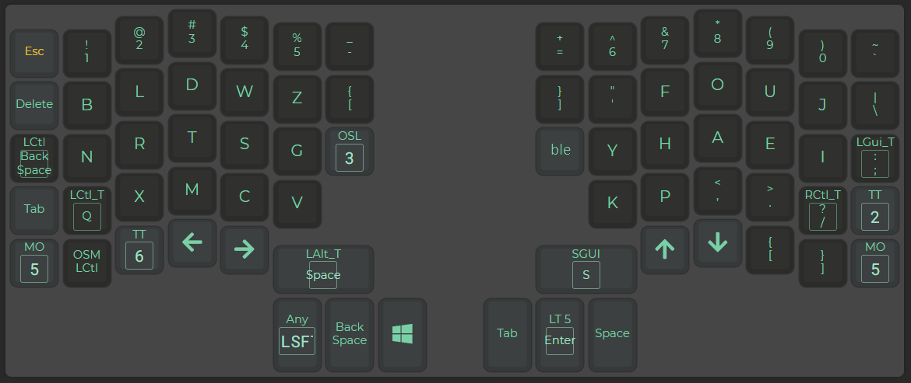

### Moonlander Graphite 🚀



QMK implementation of the [Graphite layout](https://github.com/rdavison/graphite-layout) for the [Moonlander](https://www.zsa.io/moonlander/) keyboard.

Includes a _magic key_ similar to [Magic Sturdy](https://github.com/Ikcelaks/keyboard_layouts/blob/main/magic_sturdy/magic_sturdy.md) to combat SFBs
as well as some hacks to support German Umlauts on a US layout.

You can also find an Oryx-friendly version [here](https://configure.zsa.io/moonlander/layouts/GLeeV/latest/0/intro).

```
␛ 1 2 3 4 5 -    = 6 7 8 9 0 `
␡ b l d w z [    ] ' f o u j \
↤ n r t s g ⇑    ⇑ y h a e i ;
⇄ q x m c v        k p , . / ⇑
⇑ C ⇑ ← →          ↑ ↓ [ ] ⇑
      
        ⋆ ⌥    📷 ␣
         ↤       ⏎
          🪟    ⇄    
```

The magic key `⋆` is reachable from the left thumb. Press it for magic. Hold it for shift.

The following magic combos are implemented:

| Combo  | Result   |
| ------ | -------- |
| `a⋆`   | `ation`  |
| `b⋆`   | `before` |
| `c⋆`   | `ction`  |
| `d⋆`   | `dition` |
| `e⋆`   | `eu`     |
| `f⋆`   | `fy`     |
| `g⋆`   | `gs`     |
| `h⋆`   | `hy`     |
| `i⋆`   | `ion`    |
| `j⋆`   | `just`   |
| `l⋆`   | `lation` |
| `m⋆`   | `ment`   |
| `n⋆`   | `nion`   |
| `o⋆`   | `oa`     |
| `p⋆`   | `ph`     |
| `q⋆`   | `quen`   |
| `r⋆`   | `rl`     |
| `s⋆`   | `sc`     |
| `t⋆`   | `tment`  |
| `u⋆`   | `ue`     |
| `v⋆`   | `ver`    |
| `w⋆`   | `ws`     |
| `y⋆`   | `y'`     |
| `z⋆`   | `zation` |
| ` ⋆`   | ` the`   |

If you press `o` for example and then `⋆` you'll get `oa` as a result. Normally you'd have to do some acrobatics or press first `o` with your right middle-finger and then `a` with the same finger (hence the term SFB or same-finger-bigram). If you were to type a word like `adjustment` you can simply type `adj⋆m⋆` instead 🤯. `mention` becomes `m⋆i⋆` and so on.

The `words.txt` file can be used for training.